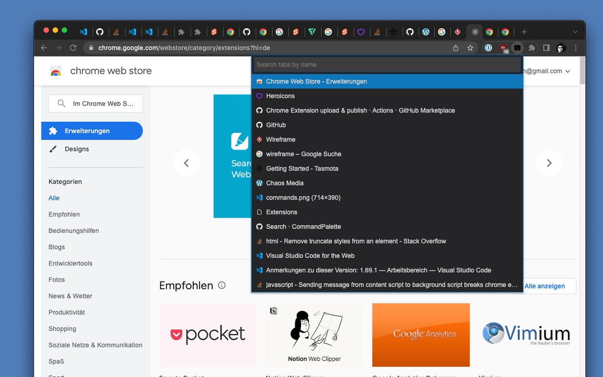
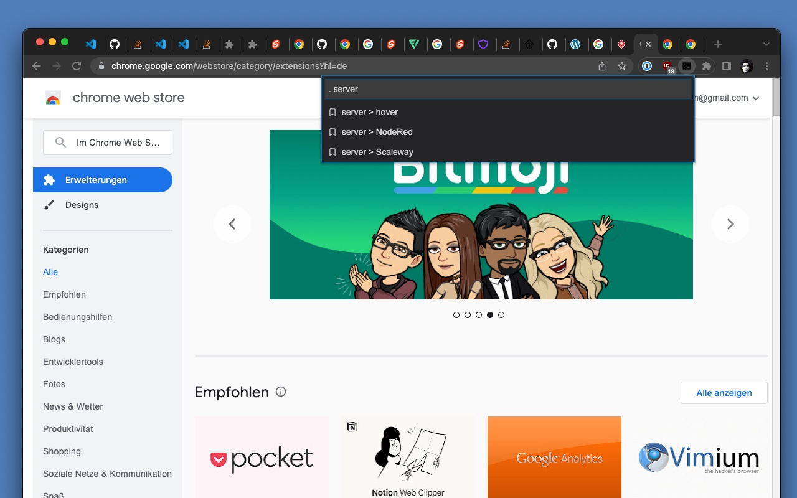

# Command Palette

> Your beloved IDE command palette in the browser.




## Development

```bash
# install dependencies
npm i

# build files to `/dist` directory
# vite.build.watch rebuilds when modules have changed on disk
npm run dev
```

## Build

```bash
# build files to `/dist` directory
$ npm run build
```

## Load unpacked extensions

1. Open the Extension Management page by navigating to `chrome://extensions`.
2. Enable Developer Mode by clicking the toggle switch next to `Developer mode`.
3. Click the `LOAD UNPACKED` button and select the `/dist` directory.
4. Go to `chrome://extensions/shortcuts` and assign a shortcut


## Attribution

- Icon by [Command line icons created by joalfa - Flaticon](https://www.flaticon.com/free-icons/command-line)
